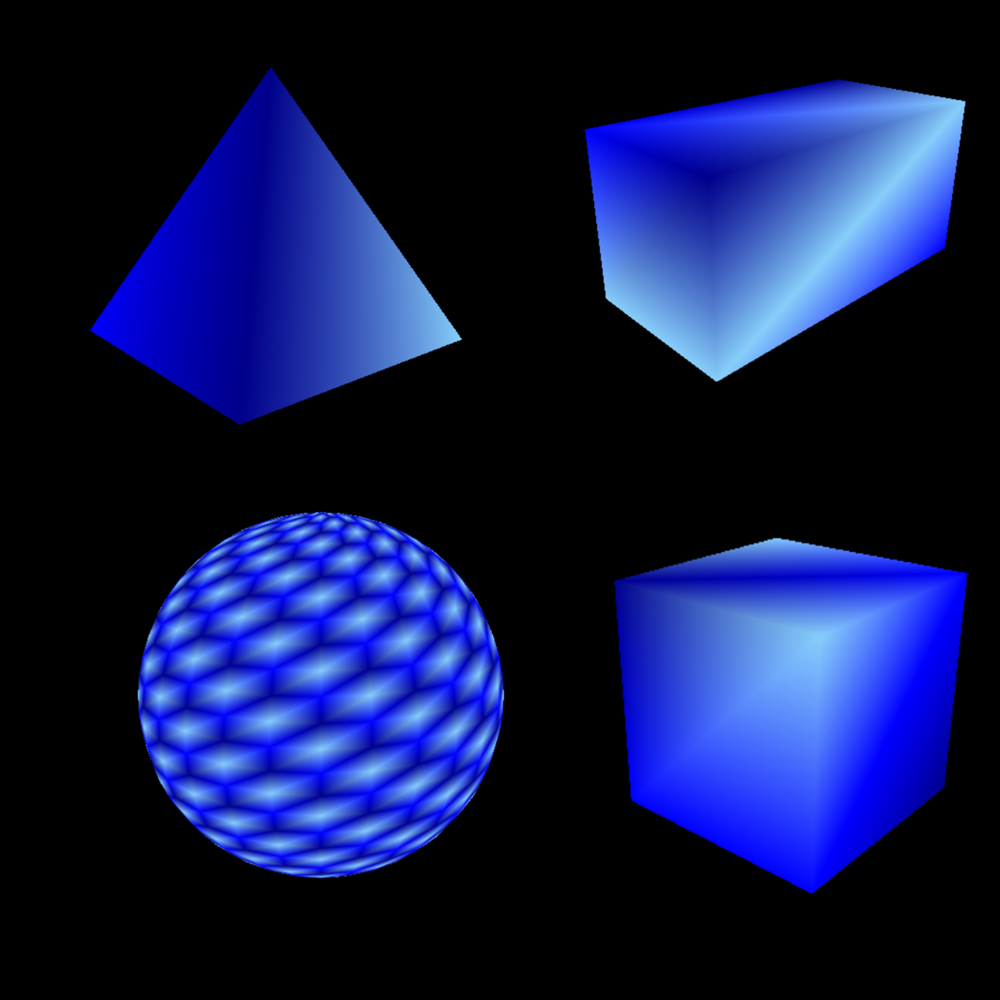
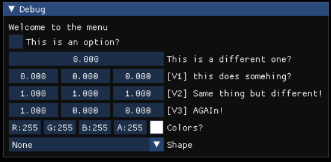
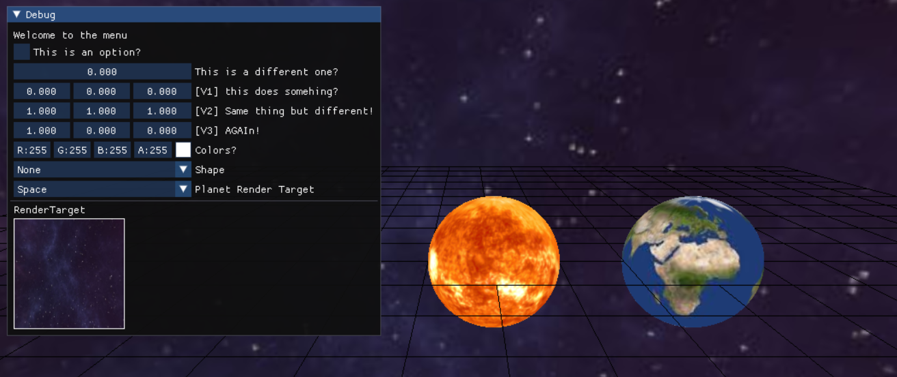

# 🐇 3D-Graphics Engine (WIP)

A lightweight C++ playground for learning modern **3D graphics programming**.  
The goal is to keep the core codebase minimal so we can focus on:

* raw vertex-buffer manipulation (no scene graph magic),
* shader experimentation, and
* rapid iteration on tiny geometry samples.

Everything you see here is deliberately “hand-rolled” to stay close to the GPU.

---

## ✨ Current micro-demo


```cpp
void Bunny::CreateShape()
{
    mVertices.clear();

    // ——— ears ———
    mVertices.push_back({ { 0.00f,  0.30f, 0.0f }, Colors::Brown });
    mVertices.push_back({ { 0.30f,  0.70f, 0.0f }, Colors::Brown });
    mVertices.push_back({ { 0.10f,  0.15f, 0.0f }, Colors::Brown });

    // … (heads, legs, body, etc. – 18 more triangles) …
}

```
## 🚀 Quick Tour

### 🌐 Real-Time Primitives
Shapez 3D starts with the fundamentals: watch it light, shade, and depth-test a **sphere, cube, rectangular prism, and pyramid** in real time.  
It’s a minimal scene—but every major subsystem (camera, shader pipeline, PBR materials) is already live.



---

### 🔧 Live Debug UI
Tap <kbd>Tab</kbd> (or your favourite hotkey) to summon an **ImGui-powered debug menu**.  
✔️ Here the user can edit the fuctions and inspect models real time.



---

### 🎯 Everything Working Together
Below is a full integration demo—**primitives + debug UI + input + render loop**—all happily co-existing.  
If it renders here, it’s ready for you to extend with your own meshes and shadersc.


